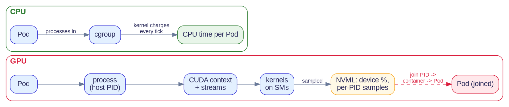
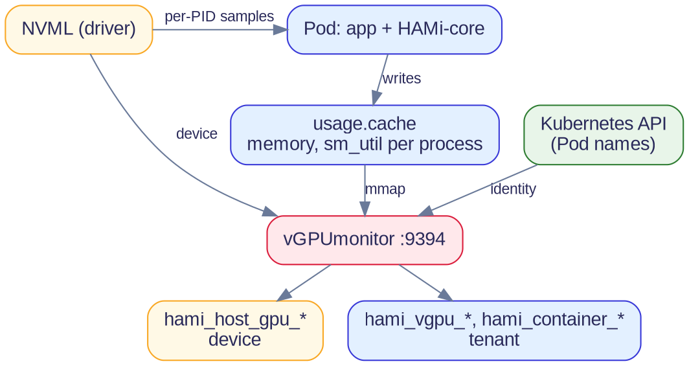

<!--
Audience narrative supplied by Reza. Implementation audit spans all 23 public Project-HAMi repositories at pinned local commits. No GPU hardware, workloads, runtime scrape, production observations or OTLP deployment were tested. Scheduling visibility covers HAMi-managed requests and allocations, not all device-plugin workloads or GPU operations.
-->
@variant dark
@kicker Kubernetes GPU observability

# One Agent, Every GPU

@subtitle Vendor-Neutral Observability from the Kubernetes Scheduler

@speaker name="Reza Jelveh" role="Solution Architect, Dynamia AI - Makers of HAMi" github=github.com/fishman linkedin=linkedin.com/in/rezajelveh

---

<!--
The supplied brief names vendor ecosystems as motivation. Intel XPU Manager is a context example, not an audited HAMi integration or a promise of Intel runtime support. Vendor tools can have Kubernetes/workload attribution; the gap is the complete intent-to-outcome correlation, not that vendor metrics can never be attributed.
-->

## One question, several vendor dashboards

::: grid {cols=2}
::: card {tag=cyan}
### The question
Are our accelerator workloads using the capacity we reserve efficiently?
:::
::: card {tag=yellow}
### The fragmentation
NVIDIA DCGM/NVML, AMD ROCm SMI, Intel XPU Manager and Ascend tooling expose different views.
:::
::: card {tag=green}
### The missing connection
Who requested this capacity? What was allocated? Which application benefits?
:::
::: card {tag=cyan}
### The architecture
Keep vendor sensors. Add a common workload identity and scheduling-intent layer.
:::
:::

---

<!--
Primer for attendees new to GPU internals. CUDA context: one process's GPU state (memory allocations, loaded kernels, streams); contexts on one card time-share the GPU. SM: Streaming Multiprocessor, the GPU's compute block (about 108 on an A100, 132 on an H100 SXM); a kernel is split into thread blocks that the hardware spreads across SMs. NVML: the NVIDIA Management Library behind nvidia-smi, shipped with the driver; device-level state plus sampled per-process data keyed by host PID, with no notion of Pod or container. DCGM builds on NVML. MIG: hardware partitioning, starting with Ampere, into up to seven GPU instances with dedicated SMs and memory. Other vendors: AMD's SM equivalent is a Compute Unit; the management libraries are AMD SMI/ROCm SMI, Huawei DCMI and Hygon rocm-smi/HY-DMI.
-->

## GPU terms in one minute

::: grid {cols=2}
::: card {tag=cyan}
### CUDA context
A process's private workspace on the GPU: memory allocations, loaded kernels and work queues (streams).
:::
::: card {tag=green}
### SM (Streaming Multiprocessor)
The GPU's compute block. A GPU is many SMs; each kernel runs as thread blocks spread across them.
:::
::: card {tag=yellow}
### NVML
NVIDIA's library behind nvidia-smi: device state plus per-process samples keyed by host PID. It knows no Pods.
:::
::: card {tag=red}
### MIG (Multi-Instance GPU)
Hardware partitioning, Ampere and newer: up to seven instances, each with its own SMs and memory.
:::
:::

::: notes
Source: [CUDA contexts](https://docs.nvidia.com/cuda/cuda-runtime-api/group__CUDART__DRIVER.html); [NVML API](https://docs.nvidia.com/deploy/nvml-api/index.html); [MIG introduction](https://docs.nvidia.com/datacenter/tesla/mig-user-guide/introduction.html)
:::

---

<!--
Operating-model difference, not a claim that CPU observability is perfect. CPU: the kernel scheduler charges CPU time to the running task, and cgroups aggregate it per container; kubelet/cAdvisor read it, so Pod CPU usage is a direct reading. GPU: the device plugin grants a device to a container (Allocate) and reports health, never executed work. Work flows Pod -> process -> CUDA context -> stream -> kernel on SMs. NVML sees the device and host PIDs; getting back to a Pod means joining host PID to container to Pod. A device-plugin allocation and a workload telemetry contract are separate interfaces.
-->

## CPU is charged; GPU is joined



- CPU: the kernel charges time to the cgroup, so Pod usage is a direct reading.
- GPU: the device plugin grants access but reports no executed work.
- NVML sees devices and host PIDs; attribution to a Pod must be joined back.

::: notes
Source: [Kubernetes device-plugin contract](https://kubernetes.io/docs/concepts/extend-kubernetes/compute-storage-net/device-plugins/); [NVML process queries](https://docs.nvidia.com/deploy/nvml-api/group__nvmlDeviceQueries.html)
:::

---

<!--
ILLUSTRATIVE TIMELINE, NOT A MEASUREMENT. cudaLaunchKernel enqueues work and returns, so CPU-side timing measures enqueueing, not GPU execution, and a request's latency includes waiting behind another tenant's kernels. Contexts from different processes time-slice the GPU by default; streams inside one context can overlap. NVML's GPU utilization is the percent of time over the sample period during which one or more kernels was executing: one small kernel on a few SMs reads as 100 percent and says nothing about whose it was. DCGM's SM activity profiling field measures how many SMs were busy. Per-process utilization is a sample keyed by host PID.
-->

## Async launches blur who used the GPU

```seaborn
import matplotlib.pyplot as plt

fg = plt.rcParams["text.color"]
dimmed = plt.rcParams["xtick.color"]
blue, red, grey = "#3939D8", "#DB1E3D", "#c0c4d6"

fig, ax = plt.subplots(figsize=(10, 3.0))
ax.set_facecolor("none")
fig.patch.set_alpha(0)

rows = {"Pod A: CPU launch": 3, "Pod A: kernels": 2, "Pod B: kernels": 1, "Device (NVML)": 0}
for name, y in rows.items():
    ax.text(-0.2, y, name, ha="right", va="center", fontsize=11, color=fg, fontweight="bold")

for t in (0.3, 2.9):
    ax.barh(3, 0.15, left=t, color=blue, height=0.5)
ax.text(0.6, 3, "returns at once", ha="left", va="center", fontsize=9.5, color=dimmed)

for left, w in ((1.2, 2.2), (4.6, 1.6)):
    ax.barh(2, w, left=left, color=blue, height=0.5)
for left, w in ((3.4, 1.2), (6.2, 2.6)):
    ax.barh(1, w, left=left, color=red, height=0.5)

ax.barh(0, 7.6, left=1.2, color=grey, height=0.5)
ax.text(5.0, 0, "\"100% busy\": a kernel was running. Whose? On how many SMs?",
        ha="center", va="center", fontsize=10, color=fg, fontweight="bold")

ax.text(-0.2, 3.75, "ILLUSTRATIVE TIMELINE, NOT A MEASUREMENT", fontsize=9.5, color=dimmed, family="monospace")
ax.text(10, -0.7, "time ->", ha="right", va="top", fontsize=9, color=dimmed)

ax.set_xlim(-0.3, 10)
ax.set_ylim(-0.9, 4.0)
ax.spines[["top", "right", "left", "bottom"]].set_visible(False)
ax.tick_params(left=False, bottom=False, labelleft=False, labelbottom=False)
```

- Starting GPU work only queues it. Timing that call on the CPU shows queuing time, not how long the GPU worked.
- Contexts from different Pods take turns; streams overlap inside one context.
- NVML "GPU utilization" means a kernel ran, not how many SMs were busy.

::: notes
Source: [NVML utilization definition](https://docs.nvidia.com/deploy/nvml-api/structs.html#structnvmlUtilization__t); [CUDA streams and concurrency](https://docs.nvidia.com/cuda/cuda-c-programming-guide/index.html#asynchronous-concurrent-execution)
:::

---

<!--
vGPUmonitor runs on each GPU node next to HAMi's device plugin. Device view: every scrape calls NVML for memory, utilization, memory-controller utilization, temperature, power and ECC, labeled by node and device UUID. Tenant view: HAMi-core, loaded inside each container, records every allocation per process and writes NVML per-process SM samples (matched by host PID) into a shared usage.cache file; vGPUmonitor maps those files and joins them to Pod names through the Kubernetes API. Caveats: tenant memory is HAMi-core's allocation accounting, not NVML's process memory; SM utilization is a share of the whole GPU, summed per container, not of the reservation; if the host-PID lookup fails, utilization reads 0 while the container may be busy. NVIDIA only; other vendors need their own collector.
-->

@layout two-col

## Where vGPUmonitor fits

- **Device view** from NVML: memory, utilization, power, temperature, ECC.
- **Tenant view** from HAMi-core's per-container cache: memory used vs limit, SM utilization.
- Joins both to Pods through the Kubernetes API and serves `:9394/metrics`.
- Tenant SM utilization is a share of the whole GPU, not of the reservation.

@col



::: notes
Source: [metric families](https://github.com/Project-HAMi/HAMi/blob/39699df26042b3e5062a76e00b3e4f74b72ad503/cmd/vGPUmonitor/metrics.go#L53-L140); [cache discovery](https://github.com/Project-HAMi/HAMi/blob/39699df26042b3e5062a76e00b3e4f74b72ad503/pkg/monitor/nvidia/cudevshr.go#L137-L140); [HAMi-core NVML samples](https://github.com/Project-HAMi/HAMi-core/blob/ec5d85a3d709e5ed138a1668ebfefd366c05ca1e/src/multiprocess/multiprocess_utilization_watcher.c#L232-L262)
:::

---

<!--
CUDA context and MIG are NVIDIA-specific examples explaining the general identity problem. A claimed utilization percentage needs a scope, sampling interval and denominator. Do not sum arbitrary GPU activity percentages or compare whole-card activity to a tenant reservation.
-->

## Scope changes attribution

::: grid {cols=3}
::: card {tag=cyan}
### CUDA context
Memory and execution live in driver/runtime contexts. A Pod-to-device mapping does not reveal every operation.
:::
::: card {tag=yellow}
### MIG instance
Use instance/profile identity and partition capacity. Whole-card utilization can hide an idle or saturated slice.
:::
::: card {tag=green}
### Soft-shared vGPU
Limits and accounting depend on the runtime interposition and sharing mode.
:::
:::

::: card {tag=red}
### Comparison rule
Compare matching physical, partition or tenant scopes with documented units.
:::

::: notes
Source: [CUDA runtime/context interaction](https://docs.nvidia.com/cuda/cuda-runtime-api/group__CUDART__DRIVER.html); [MIG guide](https://docs.nvidia.com/datacenter/tesla/mig-user-guide/introduction.html); [MIG and accounting identities](https://github.com/Project-HAMi/HAMi/blob/39699df26042b3e5062a76e00b3e4f74b72ad503/cmd/vGPUmonitor/metrics.go#L118-L138)
:::

---

<!--
Platform engineers, operators and neoclouds ask about admission and usage first; device metrics answer whether the hardware is healthy. GPU layer: admission (capacity, reservations, policy, rejection, no-fit, bind rollback) comes from scheduling and admission instrumentation and has no measured GPU usage. Usage (per-tenant consumption against its reservation on a shared device) needs per-tenant runtime accounting. Device metrics (DCGM, NVML, vendor SMI) describe the physical card. A reservation is not measured consumption. Application layer: latency, throughput, queue depth and errors are not GPU metrics; associate them with the GPU layer through stable workload identity. HAMi is not a global observer for arbitrary device-plugin allocations; coverage requires a HAMi integration. Admission and scheduling traces described later are proposed additions.
-->

## The common view operators need

**GPU layer**

::: grid {cols=3}
::: card {tag=cyan}
### Admission
Who requested what, what was reserved, and what was rejected or failed to fit?
:::
::: card {tag=green}
### Usage
How much of its reservation does each tenant use on a shared device?
:::
::: card {tag=yellow}
### Device
Memory, compute, power, temperature and errors: the hardware view.
:::
:::

**Application layer**

::: card {tag=red}
### Associate, don't re-measure
Latency, throughput, queue depth and errors, joined to the GPU layer through workload identity.
:::

::: notes
Source: [scheduler capacity](https://github.com/Project-HAMi/HAMi/blob/39699df26042b3e5062a76e00b3e4f74b72ad503/cmd/scheduler/metrics.go#L157-L200); [workload allocations](https://github.com/Project-HAMi/HAMi/blob/39699df26042b3e5062a76e00b3e4f74b72ad503/cmd/scheduler/metrics.go#L389-L455); [outcome counters](https://github.com/Project-HAMi/HAMi/blob/39699df26042b3e5062a76e00b3e4f74b72ad503/pkg/metrics/scheduler.go#L29-L55); [tenant runtime](https://github.com/Project-HAMi/HAMi/blob/39699df26042b3e5062a76e00b3e4f74b72ad503/cmd/vGPUmonitor/metrics.go#L92-L140)
:::

---

<!--
Fair framing: DCGM exporter is the best NVIDIA physical sensor and HAMi WebUI itself consumes it for physical panels. The gap is the other three planes. Pod labels come from kubelet pod-resources device assignment. NVIDIA's GPU Operator docs state that DCGM-Exporter does not associate metrics to containers when time-slicing is enabled with the NVIDIA device plugin; newer releases add opt-in --kubernetes-virtual-gpus (default false) for NVIDIA-supported time-sharing or MPS assignments. HAMi advertises replica device IDs as <uuid>-<n> rather than NVIDIA's <uuid>::<n> time-slicing form; whether dcgm-exporter maps them is untested. DEV_ fields such as DCGM_FI_DEV_FB_USED and DCGM_FI_DEV_GPU_UTIL describe the whole GPU or MIG instance; HAMi-core hook accounting supplies the per-tenant memory and SM split. Do not claim DCGM is blind to contention or waste; claim it lacks reservation, limit and scheduling context.
-->

## What DCGM exporter alone cannot answer

::: grid {cols=2}
::: card {tag=green}
### What it measures well
Whole GPU or MIG instance: memory, utilization, power, thermals, XID errors and profiling counters.
:::
::: card {tag=yellow}
### No per-tenant split
DEV_ fields describe the whole GPU or MIG instance; co-tenants on one card share one number. Time-sharing attribution is opt-in.
:::
::: card {tag=cyan}
### No budget or intent
No per-container memory limit, reserved share, sharing count or quota. Utilization has no reservation to compare against.
:::
::: card {tag=red}
### No decisions, one vendor
Pending, no-fit and rolled-back Pods never reach a GPU. AMD, Ascend and Hygon need separate stacks.
:::
:::

::: notes
Source: [time-slicing limitation](https://docs.nvidia.com/datacenter/cloud-native/gpu-operator/latest/gpu-sharing.html#limitations); [dcgm-exporter flags](https://docs.nvidia.com/datacenter/dcgm/latest/reference/command-line-reference/dcgm-exporter.html); [container limit and use](https://github.com/Project-HAMi/HAMi/blob/39699df26042b3e5062a76e00b3e4f74b72ad503/cmd/vGPUmonitor/metrics.go#L92-L102); [reservation and sharing](https://github.com/Project-HAMi/HAMi/blob/39699df26042b3e5062a76e00b3e4f74b72ad503/cmd/scheduler/metrics.go#L171-L180); [outcomes](https://github.com/Project-HAMi/HAMi/blob/39699df26042b3e5062a76e00b3e4f74b72ad503/pkg/metrics/scheduler.go#L29-L55)
:::

---

<!--
HAMi monitor is NVIDIA-specific; the existence of scheduler backends does not make this collector hardware-neutral. Shared-memory accounting and NVML process correlation need validation for the chosen sharing mode.
-->

## NVIDIA has the clearest in-repository runtime path

::: grid {cols=2}
::: card {tag=green}
### Physical device
NVML supplies used memory, GPU activity, memory-controller activity, temperature, power and ECC.
:::
::: card {tag=cyan}
### Shared workload
HAMi-core accounting supplies container memory and activity. Metrics carry namespace, pod, container and device UUID.
:::
:::

::: notes
Source: [runtime metric contract](https://github.com/Project-HAMi/HAMi/blob/39699df26042b3e5062a76e00b3e4f74b72ad503/cmd/vGPUmonitor/metrics.go#L53-L140); [NVML collection](https://github.com/Project-HAMi/HAMi/blob/39699df26042b3e5062a76e00b3e4f74b72ad503/cmd/vGPUmonitor/metrics.go#L264-L278)
:::

---

<!--
This replaces the unsupported universal-sensor claim. No per-vendor exporter is required for the scheduler allocation families themselves. Cross-vendor measured consumption still requires vendor-capable runtime collection; that collector can be integrated rather than a separately deployed exporter. Intel is not in the audited parity claims.
-->

## A common view has explicit coverage

::: grid {cols=2}
::: card {tag=green}
### NVIDIA
Scheduler accounting plus NVML/shared-runtime collector code. Sharing mode still matters.
:::
::: card {tag=yellow}
### Ascend
Mode-gated tenant memory collector. vNPU tenant activity repeats card activity; WebUI task gap remains.
:::
::: card {tag=yellow}
### AMD
Allocation and plugin-health integration; first-party tenant runtime parity is not established.
:::
::: card {tag=red}
### Other accelerators
Require a compatible backend and telemetry adapter. A device plugin alone is insufficient.
:::
:::

::: notes
Source: [scheduler capacity](https://github.com/Project-HAMi/HAMi/blob/39699df26042b3e5062a76e00b3e4f74b72ad503/cmd/scheduler/metrics.go#L157-L200); [provider adapters](https://github.com/Project-HAMi/HAMi-WebUI/blob/846c0e2d3360cc7240bb61968e4cc7e3cea53443/server/internal/exporter/exporter.go#L605-L709); [Ascend tenant semantics](https://github.com/Project-HAMi/ascend-device-plugin/blob/6f6ee0240641e9f03e6e46356910a1579b3cf276/internal/monitor/collector.go#L124-L167)
:::

---

<!--
The scheduler uses backend device metadata. Core semantics still require vendor review. Do not interpret every suffix _ratio as a normalized 0-1 value. Metric names behind each bullet. Per GPU: hami_gpu_memory_limit_bytes and hami_gpu_core_limit_ratio (what HAMi may hand out), hami_gpu_memory_allocated_bytes and hami_gpu_core_allocated_ratio (already reserved), hami_gpu_shared_count (containers sharing the GPU). Per Pod and namespace: hami_vgpu_memory_allocated_bytes and hami_vgpu_core_allocated_ratio (what each Pod reserved, on which GPU), hami_resource_quota_used and hami_resource_quota_limit. Scheduler health: hami_scheduler_is_leader (active replica), hami_scheduler_cache_synced (cluster state loaded), hami_scheduler_allocation_failures_total and hami_scheduler_bind_rollbacks_total with a fixed set of reasons such as no_fit, lock and bind. AMD reports compute in compute units; the scheduler converts it to a percentage of the device.
-->

## What the HAMi scheduler reports

- **Per GPU:** how much memory and compute HAMi can hand out, how much is already reserved, and how many containers share it.
- **Per Pod and namespace:** what each Pod reserved on which GPU, and how much of each namespace's GPU quota is used.
- **Scheduler health:** is this replica in charge, has it loaded cluster state, and why did placements fail (no GPU fits, lock, bind error)?
- **AMD:** compute units are converted to a percentage, so they compare with other vendors.
- These describe **placement and reservation**. Measured GPU work comes from runtime collectors (vGPUmonitor on NVIDIA); Prometheus keeps the history.

::: notes
Source: [AMD normalization](https://github.com/Project-HAMi/HAMi/blob/39699df26042b3e5062a76e00b3e4f74b72ad503/cmd/scheduler/metrics.go#L64-L74); [allocation families](https://github.com/Project-HAMi/HAMi/blob/39699df26042b3e5062a76e00b3e4f74b72ad503/cmd/scheduler/metrics.go#L157-L200); [pod reservations](https://github.com/Project-HAMi/HAMi/blob/39699df26042b3e5062a76e00b3e4f74b72ad503/cmd/scheduler/metrics.go#L389-L455); [namespace quotas](https://github.com/Project-HAMi/HAMi/blob/39699df26042b3e5062a76e00b3e4f74b72ad503/cmd/scheduler/metrics.go#L347-L356); [leader and cache sync](https://github.com/Project-HAMi/HAMi/blob/39699df26042b3e5062a76e00b3e4f74b72ad503/cmd/scheduler/metrics.go#L510-L519); [outcome counters](https://github.com/Project-HAMi/HAMi/blob/39699df26042b3e5062a76e00b3e4f74b72ad503/pkg/metrics/scheduler.go#L29-L55); [measured work](https://github.com/Project-HAMi/HAMi/blob/39699df26042b3e5062a76e00b3e4f74b72ad503/cmd/vGPUmonitor/metrics.go#L53-L140)
:::

---

<!--
Scheduler reservation labels are namespace,node,pod,device_uuid; runtime labels include namespace,pod,container,vdevice_index,device_uuid. A common recording-rule layer must reconcile these scopes. The scheduler iterates container/device allocations without container labels in the new family, so multi-container same-device emission/aggregation must be validated. Never perform an arbitrary direct division. Runtime memory_limit_bytes has the same labels as memory_used_bytes and supports a scoped NVIDIA memory-use/limit comparison, subject to scrape freshness and positive limits.
-->

## Reservation is not consumption

::: grid {cols=2}
::: card {tag=cyan}
### Reserved memory
`hami_vgpu_memory_allocated_bytes`

Scheduler reservation at Pod/device scope.
:::
::: card {tag=green}
### Consumed memory
`hami_vgpu_memory_used_bytes`

Runtime accounting at container/vdevice scope.
:::
:::


::: notes
Source: [workload allocations](https://github.com/Project-HAMi/HAMi/blob/39699df26042b3e5062a76e00b3e4f74b72ad503/cmd/scheduler/metrics.go#L389-L455); [tenant runtime metrics](https://github.com/Project-HAMi/HAMi/blob/39699df26042b3e5062a76e00b3e4f74b72ad503/cmd/vGPUmonitor/metrics.go#L92-L140). Screenshot: Grafana on a real cluster.
:::

---

<!--
PORTABLE PATTERN, NOT A MEASURED RESULT. For the NVIDIA runtime families, max_over_time(hami_vgpu_memory_used_bytes[1h]) divided by hami_vgpu_memory_limit_bytes is an illustrative same-label use/limit ratio. The window is an example, not an operational recommendation. Validate scrape coverage, series uniqueness, Pod restarts and limits. Current limit differs from historical limits if reconfigured. Map workload reservations separately before saying allocation efficiency. Memory pressure needs consumption/limit, memory errors and/or allocator signals; reservations alone are not measured pressure.
-->

## Pattern 1: detect persistent overprovisioning

- Compare reserved memory with observed memory over a representative window.
- Require fresh, supported runtime data and a positive limit.
- Separate idle periods, model loading and steady-state demand.
- Rank sustained headroom alongside pending or rejected workloads.
- Treat low compute activity as a separate signal, not proof of reclaimable memory.

::: notes
Source: [tenant runtime metrics](https://github.com/Project-HAMi/HAMi/blob/39699df26042b3e5062a76e00b3e4f74b72ad503/cmd/vGPUmonitor/metrics.go#L92-L140); [workload allocations](https://github.com/Project-HAMi/HAMi/blob/39699df26042b3e5062a76e00b3e4f74b72ad503/cmd/scheduler/metrics.go#L389-L455)
:::

---

<!--
PORTABLE INVESTIGATION PATTERN, NOT A PROVEN CAUSAL DETECTOR. Start with hami_gpu_shared_count, workload/device allocation mapping, runtime memory/activity and application latency. Sharing count and scheduler annotations alone cannot prove contention. Ascend vNPU card-derived activity is insufficient for tenant compute attribution. MIG isolation boundaries change which resources can contend. DCGM and vendor tools can provide valuable workload and hardware data; do not claim this pattern is beyond them when enriched with Kubernetes state.
-->

## Pattern 2: investigate noisy-neighbor candidates

- Identify co-located tenants and the physical or slice identity they share.
- Correlate rising application latency with sibling activity and memory pressure.
- Check CPU, network, queueing and thermal throttling as alternatives.
- Repeat with controlled sibling load or isolated placement.
- Card-wide activity cannot identify which tenant caused contention.

::: notes
Source: [scheduler capacity](https://github.com/Project-HAMi/HAMi/blob/39699df26042b3e5062a76e00b3e4f74b72ad503/cmd/scheduler/metrics.go#L157-L200); [tenant runtime metrics](https://github.com/Project-HAMi/HAMi/blob/39699df26042b3e5062a76e00b3e4f74b72ad503/cmd/vGPUmonitor/metrics.go#L92-L140)
:::

---

<!--
PORTABLE PATTERN, NOT AN AUTOMATED HAMi RIGHT-SIZER. GPU memory is not inferred from activity. Percentiles alone can miss startup peaks and short out-of-memory events. On shared GPUs, activity may be measured against full device capacity rather than the reserved fraction; normalize explicitly. Changes can affect contention or application throughput. No fabricated improvement percentages or production case study are supplied.
-->

## Pattern 3: right-size with workload evidence

- Measure startup peaks and steady-state demand across the workload lifecycle.
- Segment by model, batch size, request load and sharing mode.
- Choose memory headroom from peaks and failure risk.
- Tune compute limits only after normalizing quota and activity semantics.
- Canary the new request; compare latency, failures and placement outcomes.


::: notes
Source: [tenant runtime metrics](https://github.com/Project-HAMi/HAMi/blob/39699df26042b3e5062a76e00b3e4f74b72ad503/cmd/vGPUmonitor/metrics.go#L92-L140); [scheduling outcome counters](https://github.com/Project-HAMi/HAMi/blob/39699df26042b3e5062a76e00b3e4f74b72ad503/pkg/metrics/scheduler.go#L29-L55). Screenshot: HAMi-WebUI 1.3.0 on a single-node A30 cluster.
:::

---

# Advice for platform builders

@subtitle Cross-vendor GPU observability, with or without HAMi

---

<!--
PROPOSED DASHBOARD DESIGN. Allocation packing describes reservation density. Workload efficiency requires consumption and useful application output. Show capability/freshness alongside numbers and avoid equating 100 percent activity with useful computation. Panels are not claimed as deployed or demonstrated.
-->

## The operator view joins intent, activity and outcome

::: grid {cols=2}
::: card {tag=cyan}
### Allocation
Reserved/total memory, sharing count, placement failures and pending demand.
:::
::: card {tag=green}
### Runtime
Consumption/limit, scoped activity, memory errors and freshness.
:::
::: card {tag=yellow}
### Application
Latency, throughput, queue depth and error rate, by stable workload identity.
:::
::: card {tag=red}
### Confidence
Measured or derived? Supported on this vendor/mode? Current or stale?
:::
:::

---

<!--
REFERENCE ARCHITECTURE, NOT AN EXISTING HAMi OTLP INTEGRATION. OpenTelemetry Collector contrib has a Prometheus receiver; deployment/component versions, enrichment and target discovery must be validated. The proposed architecture preserves vendor/runtime sources and adds intent correlation. Existing metric units do not automatically conform to OTel semantic conventions. Do not claim one Prometheus receiver somehow removes hardware-specific sensors. Admission and scheduler events are PROPOSED INSTRUMENTATION: admission records intent (requested resources, policy decision, rejection reason), not GPU work; the scheduler emits separate events for reservation, no-fit and bind rollback. Do not invent current HAMi admission latency histograms, GPU execution spans or trace-context propagation. Existing bounded outcome counters do not carry per-Pod trace correlation. A CREATE admission request may precede stable Pod UID assignment: use the admission request identity first and reconcile once the object exists. Use stable workload/device identity and avoid PID and request-level metric labels. The scheduler does not intercept CUDA calls.
-->

## OpenTelemetry can carry the combined model

::: grid {cols=2}
::: card {tag=cyan}
### Existing inputs
HAMi Prometheus allocation metrics plus compatible runtime metrics.
:::
::: card {tag=green}
### Collector pipeline
A Prometheus receiver can scrape, enrich and export metrics through OTLP.
:::
::: card {tag=yellow}
### Admission and scheduler events
Proposed: request, policy decision and rejection; then reservation, no-fit and bind rollback.
:::
::: card {tag=cyan}
### Common attributes
Workload identity, device/slice identity, scope, unit, source and freshness.
:::
:::

::: notes
Source: [OpenTelemetry Collector](https://opentelemetry.io/docs/collector/); [Prometheus receiver](https://github.com/open-telemetry/opentelemetry-collector-contrib/tree/main/receiver/prometheusreceiver); [scheduling outcome counters](https://github.com/Project-HAMi/HAMi/blob/39699df26042b3e5062a76e00b3e4f74b72ad503/pkg/metrics/scheduler.go#L29-L55)
:::

---

<!--
PROPOSED INSTRUMENTATION. Do not invent current HAMi admission latency histograms, GPU execution spans or trace-context propagation. Existing bounded outcome counters do not carry per-Pod trace correlation. Pod UID can be available at later lifecycle stages; a CREATE admission request may precede stable Pod UID assignment. Use admission request identity initially and reconcile once the object exists. Cardinality/security budgets need explicit design. The scheduler does not intercept CUDA calls.
-->

@hidden

## Admission telemetry records intent, not GPU work

- Record requested resources, policy decisions and rejection reasons.
- Emit separate scheduler events for reservation, no-fit and bind rollback.
- Correlate runtime and application signals after the workload starts.
- Use stable workload/device identity; avoid PID and request-level metric labels.

::: notes
Source: [scheduling outcome counters](https://github.com/Project-HAMi/HAMi/blob/39699df26042b3e5062a76e00b3e4f74b72ad503/pkg/metrics/scheduler.go#L29-L55)
:::

---

<!--
PROPOSAL: this is a recommended normalization contract, not an implemented universal HAMi API. Preserve raw vendor metrics and document conversions. The "Today" line is the evidence for explicit semantics: the deck describes source contracts, not inferred Prometheus naming conventions. Runtime host GPU activity is 0-100 despite _ratio; the scheduler memory-allocation ratio is 0-1; scheduler byte families convert internal MiB to bytes; WebUI physical memory families are MiB. Normalize units at the boundary, before aggregation, and validate representative real samples before writing recording rules.
-->

## A cross-platform contract we should build

::: grid {cols=2}
::: card {tag=cyan}
### Stable identity
Cluster, node, vendor, physical device, slice, workload UID and container.
:::
::: card {tag=green}
### Explicit semantics
Reservation vs consumption; bytes vs MiB; ratio vs percent; physical vs slice vs tenant.
:::
::: card {tag=yellow}
### Capability and freshness
Measured, derived, unsupported or stale. Export the collection timestamp and error state.
:::
::: card {tag=red}
### Bounded cost
Avoid PID-level history by default. Control label churn and query fan-out.
:::
:::

**Today:** `_ratio` means 0-100 at runtime but 0-1 in the scheduler; scheduler memory is bytes, WebUI memory is MiB.

::: notes
Source: [0-100 contract](https://github.com/Project-HAMi/HAMi/blob/39699df26042b3e5062a76e00b3e4f74b72ad503/cmd/vGPUmonitor/metrics.go#L63-L72); [MiB conversion](https://github.com/Project-HAMi/HAMi/blob/39699df26042b3e5062a76e00b3e4f74b72ad503/cmd/scheduler/metrics.go#L116-L120); [0-1 contract](https://github.com/Project-HAMi/HAMi/blob/39699df26042b3e5062a76e00b3e4f74b72ad503/cmd/scheduler/metrics.go#L191-L195); [WebUI MiB](https://github.com/Project-HAMi/HAMi-WebUI/blob/846c0e2d3360cc7240bb61968e4cc7e3cea53443/server/internal/exporter/metrics.go#L68-L91)
:::

---

<!--
PROPOSED TEST PLAN. No workload was deployed as part of this static inventory. Choose representative sharing modes and vendor-specific ground truth. Never present illustrative numbers as measurements.
-->

@hidden

## Validation before a live cross-platform demo

- Reserve two workloads on one device; verify allocation identities.
- Drive one workload while the other is idle; inspect tenant attribution.
- Compare physical usage, slice usage and application latency.
- Stop the exporter; verify missing or stale does not become healthy zero.
- Restart a Pod; confirm old identity and time series expire correctly.

---

<!--
The user goals emphasize transferable architecture over a product pitch. Current implementation and proposals stay distinct. No production results or universal hardware support are asserted. Vendor telemetry can already expose many relevant signals; the contribution is the scheduling-intent/runtime/application correlation and the explicit capability contract. Speaker Bio was empty in the supplied brief; existing speaker attribution is retained without inventing biography.
-->

## Take away a workload-centric observability model

- Scheduling supplies ownership, intent and allocation decisions.
- Runtime sensors supply consumption and device behavior.
- Their correlation enables overprovisioning and contention investigations.
- OpenTelemetry can transport the model and decision events.
- The pattern applies to other schedulers and device integrations.

---

# Appendix: Source-backed platform inventory

@subtitle Collector details, integration gaps and scrape contracts

---

<!--
The Ascend plugin exposes /metrics only in HAMivNPUCore or ENPU modes. vNPUCore has tenant memory accounting, but its tenant utilization repeats physical AICore activity. Context/module/buffer values are zero placeholders. WebUI's task metric adapters explicitly return unsupported even though the plugin emits some task memory series. This is an integration gap, not absence of all Ascend observability.
-->
## Ascend: exporter support depends on mode

- HAMivNPUCore and ENPU modes expose `:9395/metrics`.
- Tenant memory comes from shared accounting or DCMI process attribution.
- vNPU tenant utilization repeats **physical AICore activity**.
- Context/module/buffer memory fields are zero placeholders.
- WebUI physical NPU adapters exist; task adapters remain unsupported.

::: notes
Source: [mode gate](https://github.com/Project-HAMi/ascend-device-plugin/blob/6f6ee0240641e9f03e6e46356910a1579b3cf276/cmd/main.go#L154-L165); [tenant semantics](https://github.com/Project-HAMi/ascend-device-plugin/blob/6f6ee0240641e9f03e6e46356910a1579b3cf276/internal/monitor/collector.go#L124-L167); [WebUI gap](https://github.com/Project-HAMi/HAMi-WebUI/blob/846c0e2d3360cc7240bb61968e4cc7e3cea53443/server/internal/exporter/exporter.go#L687-L709)
:::

---

<!--
The audited dcu-exporter emits vdcu_utilizationrate and vdcu_usedmemory_bytes with PodResources workload labels. WebUI's DCU workload queries instead expect vdcu_percent and vdcu_usage_memory_size with pod_uuid/container_name. These contracts do not match at the pinned versions. Physical telemetry queries align more closely. New HCU adapters are separate and their exporter is outside this organization inventory.
-->
## Hygon: physical exporter, workload contract mismatch

- DCU exporter serves `/metrics` on default port **16080**.
- Physical and virtual gauges poll DCGM every **10 seconds**.
- Exporter: `vdcu_utilizationrate`, `vdcu_usedmemory_bytes`.
- WebUI expects `vdcu_percent`, `vdcu_usage_memory_size` and different labels.
- Validate or bridge the workload contract before demoing WebUI trends.

::: notes
Source: [exported virtual families](https://github.com/Project-HAMi/dcu-exporter/blob/30408d074cd420729f5698710d54fb30abefb0b1/main.go#L144-L177); [polling and endpoint](https://github.com/Project-HAMi/dcu-exporter/blob/30408d074cd420729f5698710d54fb30abefb0b1/main.go#L405-L471); [compute query](https://github.com/Project-HAMi/HAMi-WebUI/blob/846c0e2d3360cc7240bb61968e4cc7e3cea53443/server/internal/exporter/exporter.go#L696-L701); [memory query](https://github.com/Project-HAMi/HAMi-WebUI/blob/846c0e2d3360cc7240bb61968e4cc7e3cea53443/server/internal/exporter/exporter.go#L791-L811)
:::

---

<!--
Negative findings are scoped to audited first-party code. They do not mean vendor monitoring software does not exist. See the vendor report for exact health paths and source evidence.
-->

## AMD and Biren: scheduling does not prove metric parity

::: grid {cols=2}
::: card {tag=yellow}
### AMD
ROCm/AMD plugin health integration exists. Scheduler reservations are visible. No AMD-specific WebUI telemetry adapter in the reviewed switch.
:::
::: card {tag=red}
### Biren
Device registration, allocation and health logic need a separate exporter contract. No Biren WebUI telemetry branch in the reviewed switch.
:::
:::

::: notes
Source: [AMD accounting](https://github.com/Project-HAMi/HAMi/blob/39699df26042b3e5062a76e00b3e4f74b72ad503/cmd/scheduler/metrics.go#L64-L74); [implemented provider branches](https://github.com/Project-HAMi/HAMi-WebUI/blob/846c0e2d3360cc7240bb61968e4cc7e3cea53443/server/internal/exporter/exporter.go#L605-L684)
:::

---

<!--
Adapters exist, but the first-party Project-HAMi organization snapshot does not contain every vendor exporter. Cambricon and some other legacy task paths retain a card-utilization fallback, which must not be described as direct per-container measurement.
-->

## Cambricon and MetaX use external metric contracts

::: grid {cols=2}
::: card {tag=cyan}
### Cambricon
WebUI queries `mlu_*` series and joins container mapping on UUID. Workload attribution inherits exporter semantics.
:::
::: card {tag=green}
### MetaX
WebUI queries `mx_*` physical and workload series. GPU and sGPU paths have different identity labels and assumptions.
:::
:::

::: notes
Source: [provider queries](https://github.com/Project-HAMi/HAMi-WebUI/blob/846c0e2d3360cc7240bb61968e4cc7e3cea53443/server/internal/exporter/exporter.go#L687-L709); [conversion and fallback](https://github.com/Project-HAMi/HAMi-WebUI/blob/846c0e2d3360cc7240bb61968e4cc7e3cea53443/server/internal/exporter/exporter.go#L744-L788); [workload memory](https://github.com/Project-HAMi/HAMi-WebUI/blob/846c0e2d3360cc7240bb61968e4cc7e3cea53443/server/internal/exporter/exporter.go#L791-L811)
:::

---

<!--
The documentation report lists documented vendors and the corresponding source paths. No universal exporter or per-tenant metric contract is inferred from a resource-name entry.
-->

## Other scheduling backends remain evidence gaps

- HAMi documents more hardware than WebUI has telemetry adapters.
- Iluvatar, Enflame, Kunlunxin, Mthreads and other backends need exporter-by-exporter review.
- Check physical health, runtime usage and workload attribution independently.
- Label an unverified capability **unknown**, not zero or supported.

---

<!--
Why "normalization layer": WebUI does not measure hardware. Every 30 s it reads HAMi allocation state from node and Pod annotations, sends one PromQL query per device to the vendor's own exporter (DCGM, npu-exporter, mlu, mx, dcu, hcu), converts units (bytes or KB to MiB, MetaX mW to W), maps vendor label keys (UUID, uuid, vdie_id, device_id) onto common node/provider/device_uuid labels, and re-exports one hami_* vocabulary. Boundaries: Ascend workload telemetry is unsupported, DCU workload queries do not match dcu-exporter, and MLU/DCU/MetaX keep a card-utilization fallback. NVIDIA and HCU task activity conversions explicitly exclude elastic borrowing; other vendor paths differ. Physical-card activity must not substitute for an individual tenant on a shared card.
-->

## WebUI is a normalization layer with boundaries

- Uses Kubernetes allocation state plus Prometheus vendor queries.
- Converts vendor units and label keys into common `hami_memory_*`, `hami_core_*` and container families.
- Marks unknown core allocation instead of manufacturing capacity.
- Exposes refresh health and last-success timestamp.
- Common names do not guarantee common measurement semantics.

::: notes
Source: [unit conversion](https://github.com/Project-HAMi/HAMi-WebUI/blob/846c0e2d3360cc7240bb61968e4cc7e3cea53443/server/internal/exporter/exporter.go#L655-L664); [refresh health](https://github.com/Project-HAMi/HAMi-WebUI/blob/846c0e2d3360cc7240bb61968e4cc7e3cea53443/server/internal/exporter/metrics.go#L44-L49); [known/unknown and usage](https://github.com/Project-HAMi/HAMi-WebUI/blob/846c0e2d3360cc7240bb61968e4cc7e3cea53443/server/internal/exporter/metrics.go#L163-L180); [semantics](https://github.com/Project-HAMi/HAMi-WebUI/blob/846c0e2d3360cc7240bb61968e4cc7e3cea53443/server/internal/exporter/exporter.go#L744-L788)
:::

---

<!--
HAMi-DRA implements an optional allocation monitor on :8080/metrics. It watches ResourceSlices and ResourceClaims and reports consumed capacity, not actual hardware use. Its current core ratio families are normalized 0-1, unlike classic HAMi percentage-style core accounting. The NVIDIA kubelet DRA driver handles device health through logs/ResourceSlice changes; this is not a GPU Prometheus exporter.
-->
## DRA has a distinct allocation monitor

- HAMi-DRA serves allocation metrics at `:8080/metrics`.
- Capacity comes from ResourceSlices; reservations from ResourceClaims.
- Current families use `hami_dra_*` names and core ratios **0-1**.
- Kubelet-driver health and Prepare/Unprepare are a separate surface.
- Runtime device and tenant telemetry still require their own collectors.

::: notes
Source: [DRA descriptors](https://github.com/Project-HAMi/HAMi-DRA/blob/ab103e2f93d743e8140bf4431437dc86b7718a22/pkg/metrics/metrics.go#L21-L52); [normalization](https://github.com/Project-HAMi/HAMi-DRA/blob/ab103e2f93d743e8140bf4431437dc86b7718a22/pkg/metrics/collector.go#L27-L116); [endpoint setup](https://github.com/Project-HAMi/HAMi-DRA/blob/ab103e2f93d743e8140bf4431437dc86b7718a22/docs/MONITOR.md#L1-L67)
:::

---

<!--
These are checked-in template conditions, not a claim that Prometheus Operator is installed in any cluster. Confirm effective release values and ServiceMonitor selector matching.
-->

## Scrape configuration is part of the contract

- HAMi provides separate scheduler and runtime ServiceMonitors.
- Chart rendering requires the ServiceMonitor CRD and `prometheus.enabled`.
- Runtime monitor also requires the device plugin to be enabled.
- Both templates set `honorLabels: true`.
- Verify target selection, labels and actual series after installation.

::: notes
Source: [scheduler scrape](https://github.com/Project-HAMi/HAMi/blob/39699df26042b3e5062a76e00b3e4f74b72ad503/charts/hami/templates/scheduler/servicemonitor.yaml#L1-L23); [runtime scrape](https://github.com/Project-HAMi/HAMi/blob/39699df26042b3e5062a76e00b3e4f74b72ad503/charts/hami/templates/device-plugin/servicemonitor.yaml#L1-L23)
:::

---

<!--
Review the documentation report for legacy dashboard references. A successful HTTP scrape does not prove the query expected by a panel returns data.
-->

## Version skew can silently break dashboards

- Current `hami_*` names coexist with opt-in legacy descriptors.
- Names and labels changed together: `deviceuuid` versus `device_uuid`.
- Some older guides expect legacy families; current Grafana JSON uses `hami_*`.
- Pin exporter, scheduler, WebUI and dashboard versions together.
- Test missing series as well as successful queries.

::: notes
Source: [legacy runtime descriptors](https://github.com/Project-HAMi/HAMi/blob/39699df26042b3e5062a76e00b3e4f74b72ad503/cmd/vGPUmonitor/metrics.go#L142-L194); [current NVIDIA selector](https://github.com/Project-HAMi/HAMi-WebUI/blob/846c0e2d3360cc7240bb61968e4cc7e3cea53443/server/internal/exporter/exporter.go#L713-L715)
:::
