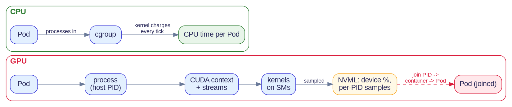
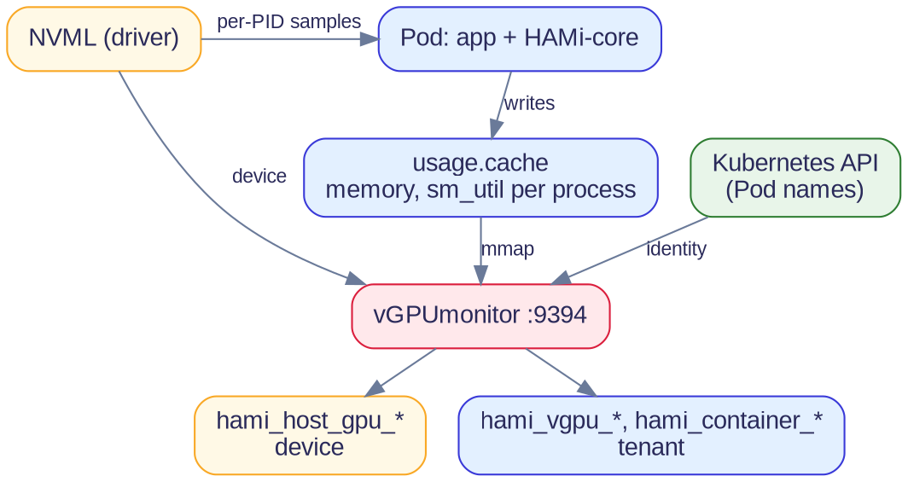

<!--
- Source review of all 23 Project-HAMi repos at pinned commits
- Nothing measured on GPUs: no live cluster, scrape or OTLP deployment
- "Every GPU" = every GPU HAMi schedules, not every device-plugin Pod
-->
@variant dark
@kicker Kubernetes GPU observability

# One Agent, Every GPU

@subtitle Vendor-Neutral Observability from the Kubernetes Scheduler

@speaker name="Reza Jelveh" role="Solution Architect, Dynamia AI - Makers of HAMi" github=github.com/fishman linkedin=linkedin.com/in/rezajelveh

---

<!--
- Ask the room: who runs more than one GPU vendor today?
- Intel XPU Manager is motivation only; Intel is not in this audit
- Vendor tools can label workloads; the gap is joining request, reservation and outcome
-->

## One question, many dashboards

::: grid {cols=2}
::: card {tag=cyan}
### The question
Are our accelerator workloads using the capacity we reserve efficiently?
:::
::: card {tag=yellow}
### The fragmentation
NVIDIA DCGM/NVML, AMD ROCm SMI, Intel XPU Manager and Ascend tooling expose different views.
:::
::: card {tag=green}
### The missing connection
Who requested this capacity? What was allocated? Which application benefits?
:::
::: card {tag=cyan}
### The architecture
Keep vendor sensors. Add a common workload identity and scheduling-intent layer.
:::
:::

---

<!--
- SM counts: about 108 on an A100, 132 on an H100 SXM
- NVML ships with the driver; DCGM and dcgm-exporter build on it
- MIG needs Ampere or newer, up to seven instances
- AMD: Compute Unit instead of SM, AMD SMI instead of NVML; Ascend uses DCMI
-->

## GPU terms in one minute

::: grid {cols=2}
::: card {tag=cyan}
### CUDA context
A process's private workspace on the GPU: memory allocations, loaded kernels and work queues (streams).
:::
::: card {tag=green}
### SM (Streaming Multiprocessor)
The GPU's compute block. A GPU is many SMs; each kernel runs as thread blocks spread across them.
:::
::: card {tag=yellow}
### NVML
NVIDIA's library behind nvidia-smi: device state plus per-process samples keyed by host PID. It knows no Pods.
:::
::: card {tag=red}
### MIG (Multi-Instance GPU)
Hardware partitioning, Ampere and newer: up to seven instances, each with its own SMs and memory.
:::
:::

::: notes
Source: [CUDA contexts](https://docs.nvidia.com/cuda/cuda-runtime-api/group__CUDART__DRIVER.html); [NVML API](https://docs.nvidia.com/deploy/nvml-api/index.html); [MIG introduction](https://docs.nvidia.com/datacenter/tesla/mig-user-guide/introduction.html)
:::

---

<!--
- CPU: kernel charges time to the task, cgroups sum it, kubelet/cAdvisor read it
- GPU: device plugin Allocate hands out a device and health, never executed work
- NVML reports host PIDs; joining them to Pods needs extra code (HAMi-core on NVIDIA)
- Not "CPU is perfect": the point is where the accounting lives
-->

## Why GPU usage is hard to attribute



- CPU: the kernel charges time to the cgroup, so Pod usage is a direct reading.
- GPU: the device plugin grants access but reports no executed work.
- NVML sees devices and host PIDs; attribution to a Pod must be joined back.

::: notes
Source: [Kubernetes device-plugin contract](https://kubernetes.io/docs/concepts/extend-kubernetes/compute-storage-net/device-plugins/); [NVML process queries](https://docs.nvidia.com/deploy/nvml-api/group__nvmlDeviceQueries.html)
:::

---

<!--
- Timeline is illustrative, not measured
- cudaLaunchKernel returns at once; timing it on the CPU gives enqueue time
- Request latency includes waiting behind other tenants' kernels
- NVML GPU util = share of time any kernel ran; DCGM SM_ACTIVE = how many SMs were busy
-->

## Queued GPU work blurs who used it

```seaborn
import matplotlib.pyplot as plt

fg = plt.rcParams["text.color"]
dimmed = plt.rcParams["xtick.color"]
blue, red, grey = "#3939D8", "#DB1E3D", "#c0c4d6"

fig, ax = plt.subplots(figsize=(10, 3.0))
ax.set_facecolor("none")
fig.patch.set_alpha(0)

rows = {"Pod A: CPU launch": 3, "Pod A: kernels": 2, "Pod B: kernels": 1, "Device (NVML)": 0}
for name, y in rows.items():
    ax.text(-0.2, y, name, ha="right", va="center", fontsize=11, color=fg, fontweight="bold")

for t in (0.3, 2.9):
    ax.barh(3, 0.15, left=t, color=blue, height=0.5)
ax.text(0.6, 3, "returns at once", ha="left", va="center", fontsize=9.5, color=dimmed)

for left, w in ((1.2, 2.2), (4.6, 1.6)):
    ax.barh(2, w, left=left, color=blue, height=0.5)
for left, w in ((3.4, 1.2), (6.2, 2.6)):
    ax.barh(1, w, left=left, color=red, height=0.5)

ax.barh(0, 7.6, left=1.2, color=grey, height=0.5)
ax.text(5.0, 0, "\"100% busy\": a kernel was running. Whose? On how many SMs?",
        ha="center", va="center", fontsize=10, color=fg, fontweight="bold")

ax.text(-0.2, 3.75, "ILLUSTRATIVE TIMELINE, NOT A MEASUREMENT", fontsize=9.5, color=dimmed, family="monospace")
ax.text(10, -0.7, "time ->", ha="right", va="top", fontsize=9, color=dimmed)

ax.set_xlim(-0.3, 10)
ax.set_ylim(-0.9, 4.0)
ax.spines[["top", "right", "left", "bottom"]].set_visible(False)
ax.tick_params(left=False, bottom=False, labelleft=False, labelbottom=False)
```

- Starting GPU work only queues it. Timing that call on the CPU shows queuing time, not how long the GPU worked.
- Contexts from different Pods take turns; streams overlap inside one context.
- NVML "GPU utilization" means a kernel ran, not how many SMs were busy.

::: notes
Source: [NVML utilization definition](https://docs.nvidia.com/deploy/nvml-api/structs.html#structnvmlUtilization__t); [CUDA streams and concurrency](https://docs.nvidia.com/cuda/cuda-c-programming-guide/index.html#asynchronous-concurrent-execution)
:::

---

<!--
- Runs on each GPU node next to HAMi's device plugin, serves :9394/metrics
- Tenant memory = HAMi-core allocation accounting, not NVML process memory
- If host-PID lookup fails, utilization reads 0 while the Pod is busy: zero is not idle
- NVIDIA only; Ascend and Hygon collectors are in the appendix
-->

@layout two-col

## How vGPUmonitor works on NVIDIA

- **Device view** from NVML: memory, utilization, power, temperature, ECC.
- **Tenant view** from HAMi-core's per-container cache: memory used vs limit, SM utilization.
- Joins both to Pods through the Kubernetes API and serves `:9394/metrics`.
- Tenant SM utilization is a share of the whole GPU, not of the reservation.

@col



::: notes
Source: [metric families](https://github.com/Project-HAMi/HAMi/blob/39699df26042b3e5062a76e00b3e4f74b72ad503/cmd/vGPUmonitor/metrics.go#L53-L140); [cache discovery](https://github.com/Project-HAMi/HAMi/blob/39699df26042b3e5062a76e00b3e4f74b72ad503/pkg/monitor/nvidia/cudevshr.go#L137-L140); [HAMi-core NVML samples](https://github.com/Project-HAMi/HAMi-core/blob/ec5d85a3d709e5ed138a1668ebfefd366c05ca1e/src/multiprocess/multiprocess_utilization_watcher.c#L232-L262)
:::

---

<!--
- Every utilization number needs a scope, a sampling window and a denominator
- Never add up activity percentages from different scopes
- Never compare whole-card activity with one tenant's reservation
-->

## Same GPU, three different scopes

::: grid {cols=3}
::: card {tag=cyan}
### CUDA context
Memory and execution live in driver/runtime contexts. A Pod-to-device mapping does not reveal every operation.
:::
::: card {tag=yellow}
### MIG instance
Use instance/profile identity and partition capacity. Whole-card utilization can hide an idle or saturated slice.
:::
::: card {tag=green}
### Soft-shared vGPU
Limits and accounting depend on the runtime interposition and sharing mode.
:::
:::

::: card {tag=red}
### Comparison rule
Compare matching physical, partition or tenant scopes with documented units.
:::

::: notes
Source: [CUDA runtime/context interaction](https://docs.nvidia.com/cuda/cuda-runtime-api/group__CUDART__DRIVER.html); [MIG guide](https://docs.nvidia.com/datacenter/tesla/mig-user-guide/introduction.html); [MIG and accounting identities](https://github.com/Project-HAMi/HAMi/blob/39699df26042b3e5062a76e00b3e4f74b72ad503/cmd/vGPUmonitor/metrics.go#L118-L138)
:::

---

<!--
- Operators and neoclouds ask about admission and usage first; device health comes later
- Admission has no GPU usage yet: requests, decisions, rejections
- On shared GPUs only per-tenant accounting answers usage; device metrics can't split it
- HAMi only sees Pods it schedules, not arbitrary device-plugin Pods
-->

## The common view operators need

**GPU layer**

::: grid {cols=3}
::: card {tag=cyan}
### Admission
Who requested what, what was reserved, and what was rejected or failed to fit?
:::
::: card {tag=green}
### Usage
How much of its reservation does each tenant use on a shared device?
:::
::: card {tag=yellow}
### Device
Memory, compute, power, temperature and errors: the hardware view.
:::
:::

**Application layer**

::: card {tag=red}
### Associate, don't re-measure
Latency, throughput, queue depth and errors, joined to the GPU layer through workload identity.
:::

::: notes
Source: [scheduler capacity](https://github.com/Project-HAMi/HAMi/blob/39699df26042b3e5062a76e00b3e4f74b72ad503/cmd/scheduler/metrics.go#L157-L200); [workload allocations](https://github.com/Project-HAMi/HAMi/blob/39699df26042b3e5062a76e00b3e4f74b72ad503/cmd/scheduler/metrics.go#L389-L455); [outcome counters](https://github.com/Project-HAMi/HAMi/blob/39699df26042b3e5062a76e00b3e4f74b72ad503/pkg/metrics/scheduler.go#L29-L55); [tenant runtime](https://github.com/Project-HAMi/HAMi/blob/39699df26042b3e5062a76e00b3e4f74b72ad503/cmd/vGPUmonitor/metrics.go#L92-L140)
:::

---

<!--
- Be fair: DCGM is the best NVIDIA hardware sensor, and HAMi WebUI uses it
- NVIDIA docs: no container attribution under device-plugin time-slicing
- --kubernetes-virtual-gpus is opt-in; HAMi's <uuid>-<n> device IDs are untested with it
- Claim missing context, not blindness to contention or waste
-->

## What DCGM alone cannot answer

::: grid {cols=2}
::: card {tag=green}
### What it measures well
Whole GPU or MIG instance: memory, utilization, power, thermals, XID errors and profiling counters.
:::
::: card {tag=yellow}
### No per-tenant split
DEV_ fields describe the whole GPU or MIG instance; co-tenants on one card share one number. Time-sharing attribution is opt-in.
:::
::: card {tag=cyan}
### No budget or intent
No per-container memory limit, reserved share, sharing count or quota. Utilization has no reservation to compare against.
:::
::: card {tag=red}
### No decisions, one vendor
Pending, no-fit and rolled-back Pods never reach a GPU. AMD, Ascend and Hygon need separate stacks.
:::
:::

::: notes
Source: [time-slicing limitation](https://docs.nvidia.com/datacenter/cloud-native/gpu-operator/latest/gpu-sharing.html#limitations); [dcgm-exporter flags](https://docs.nvidia.com/datacenter/dcgm/latest/reference/command-line-reference/dcgm-exporter.html); [container limit and use](https://github.com/Project-HAMi/HAMi/blob/39699df26042b3e5062a76e00b3e4f74b72ad503/cmd/vGPUmonitor/metrics.go#L92-L102); [reservation and sharing](https://github.com/Project-HAMi/HAMi/blob/39699df26042b3e5062a76e00b3e4f74b72ad503/cmd/scheduler/metrics.go#L171-L180); [outcomes](https://github.com/Project-HAMi/HAMi/blob/39699df26042b3e5062a76e00b3e4f74b72ad503/pkg/metrics/scheduler.go#L29-L55)
:::

---

<!--
- Most complete: device plus per-tenant memory and compute; Ascend has tenant memory only
- Behaviour differs by sharing mode: validate HAMi-core sharing and MIG separately
- A scheduler backend for a vendor does not imply a collector for it
-->

## NVIDIA has the fullest usage data

::: grid {cols=2}
::: card {tag=green}
### Physical device
NVML supplies used memory, GPU activity, memory-controller activity, temperature, power and ECC.
:::
::: card {tag=cyan}
### Shared workload
HAMi-core accounting supplies container memory and activity. Metrics carry namespace, pod, container and device UUID.
:::
:::

::: notes
Source: [runtime metric contract](https://github.com/Project-HAMi/HAMi/blob/39699df26042b3e5062a76e00b3e4f74b72ad503/cmd/vGPUmonitor/metrics.go#L53-L140); [NVML collection](https://github.com/Project-HAMi/HAMi/blob/39699df26042b3e5062a76e00b3e4f74b72ad503/cmd/vGPUmonitor/metrics.go#L264-L278)
:::

---

<!--
- Scheduler reservation metrics work for every integrated vendor, no extra exporter
- Per-tenant measured usage needs a vendor-specific collector
- AMD gap and questions: research/cross-platform-observability/hami-team-amd-tenant-telemetry.md
- Intel is not covered
-->

## What HAMi covers for each vendor

::: grid {cols=2}
::: card {tag=green}
### NVIDIA
Scheduler accounting plus NVML/shared-runtime collector code. Sharing mode still matters.
:::
::: card {tag=yellow}
### Ascend
Mode-gated tenant memory collector. vNPU tenant activity repeats card activity; WebUI task gap remains.
:::
::: card {tag=yellow}
### AMD
Allocation and plugin-health integration; first-party tenant runtime parity is not established.
:::
::: card {tag=red}
### Other accelerators
Require a compatible backend and telemetry adapter. A device plugin alone is insufficient.
:::
:::

::: notes
Source: [scheduler capacity](https://github.com/Project-HAMi/HAMi/blob/39699df26042b3e5062a76e00b3e4f74b72ad503/cmd/scheduler/metrics.go#L157-L200); [provider adapters](https://github.com/Project-HAMi/HAMi-WebUI/blob/846c0e2d3360cc7240bb61968e4cc7e3cea53443/server/internal/exporter/exporter.go#L605-L709); [Ascend tenant semantics](https://github.com/Project-HAMi/ascend-device-plugin/blob/6f6ee0240641e9f03e6e46356910a1579b3cf276/internal/monitor/collector.go#L124-L167)
:::

---

<!--
- Per GPU: hami_gpu_memory_limit_bytes, hami_gpu_memory_allocated_bytes, hami_gpu_core_allocated_ratio, hami_gpu_shared_count
- Per Pod/namespace: hami_vgpu_memory_allocated_bytes, hami_resource_quota_used / _limit
- Health: hami_scheduler_is_leader, hami_scheduler_cache_synced, hami_scheduler_allocation_failures_total (no_fit, lock, bind...)
- Core _ratio here is 0-100, not 0-1
-->

## What the HAMi scheduler reports

- **Per GPU:** how much memory and compute HAMi can hand out, how much is already reserved, and how many containers share it.
- **Per Pod and namespace:** what each Pod reserved on which GPU, and how much of each namespace's GPU quota is used.
- **Scheduler health:** is this replica in charge, has it loaded cluster state, and why did placements fail (no GPU fits, lock, bind error)?
- **AMD:** compute units are converted to a percentage, so they compare with other vendors.
- These describe **placement and reservation**. Measured GPU work comes from runtime collectors (vGPUmonitor on NVIDIA); Prometheus keeps the history.

::: notes
Source: [AMD normalization](https://github.com/Project-HAMi/HAMi/blob/39699df26042b3e5062a76e00b3e4f74b72ad503/cmd/scheduler/metrics.go#L64-L74); [allocation families](https://github.com/Project-HAMi/HAMi/blob/39699df26042b3e5062a76e00b3e4f74b72ad503/cmd/scheduler/metrics.go#L157-L200); [pod reservations](https://github.com/Project-HAMi/HAMi/blob/39699df26042b3e5062a76e00b3e4f74b72ad503/cmd/scheduler/metrics.go#L389-L455); [namespace quotas](https://github.com/Project-HAMi/HAMi/blob/39699df26042b3e5062a76e00b3e4f74b72ad503/cmd/scheduler/metrics.go#L347-L356); [leader and cache sync](https://github.com/Project-HAMi/HAMi/blob/39699df26042b3e5062a76e00b3e4f74b72ad503/cmd/scheduler/metrics.go#L510-L519); [outcome counters](https://github.com/Project-HAMi/HAMi/blob/39699df26042b3e5062a76e00b3e4f74b72ad503/pkg/metrics/scheduler.go#L29-L55); [measured work](https://github.com/Project-HAMi/HAMi/blob/39699df26042b3e5062a76e00b3e4f74b72ad503/cmd/vGPUmonitor/metrics.go#L53-L140)
:::

---

<!--
- Chart: Grafana on a real cluster, 5 GiB reserved vs 0-4.49 GiB used
- Scheduler labels: namespace, node, pod, device_uuid; runtime adds container, vdevice_index
- Join on namespace, pod, device_uuid after summing runtime series per Pod
- Validate multi-container Pods on one GPU before trusting the join
-->

## Reserved is not the same as used

::: grid {cols=2}
::: card {tag=cyan}
### Reserved memory
`hami_vgpu_memory_allocated_bytes`

Scheduler reservation at Pod/device scope.
:::
::: card {tag=green}
### Consumed memory
`hami_vgpu_memory_used_bytes`

Runtime accounting at container/vdevice scope.
:::
:::


::: notes
Source: [workload allocations](https://github.com/Project-HAMi/HAMi/blob/39699df26042b3e5062a76e00b3e4f74b72ad503/cmd/scheduler/metrics.go#L389-L455); [tenant runtime metrics](https://github.com/Project-HAMi/HAMi/blob/39699df26042b3e5062a76e00b3e4f74b72ad503/cmd/vGPUmonitor/metrics.go#L92-L140). Screenshot: Grafana on a real cluster.
:::

---

<!--
- A pattern, not a measured result
- Example: max_over_time(hami_vgpu_memory_used_bytes[1h]) / hami_vgpu_memory_limit_bytes
- Check scrape gaps, Pod restarts and limit changes before acting
- Low compute alone does not mean memory can be reclaimed
-->

## Pattern 1: find unused reservations

- Compare reserved memory with observed memory over a representative window.
- Require fresh, supported runtime data and a positive limit.
- Separate idle periods, model loading and steady-state demand.
- Rank sustained headroom alongside pending or rejected workloads.
- Treat low compute activity as a separate signal, not proof of reclaimable memory.

::: notes
Source: [tenant runtime metrics](https://github.com/Project-HAMi/HAMi/blob/39699df26042b3e5062a76e00b3e4f74b72ad503/cmd/vGPUmonitor/metrics.go#L92-L140); [workload allocations](https://github.com/Project-HAMi/HAMi/blob/39699df26042b3e5062a76e00b3e4f74b72ad503/cmd/scheduler/metrics.go#L389-L455)
:::

---

<!--
- Investigation pattern, not proof of cause
- Start from hami_gpu_shared_count to find co-located tenants
- Ascend tenant utilization repeats card activity: can't attribute compute there
- MIG slices don't contend for compute like soft-shared tenants do
-->

## Pattern 2: track down noisy neighbors

- Identify co-located tenants and the physical or slice identity they share.
- Correlate rising application latency with sibling activity and memory pressure.
- Check CPU, network, queueing and thermal throttling as alternatives.
- Repeat with controlled sibling load or isolated placement.
- Card-wide activity cannot identify which tenant caused contention.

::: notes
Source: [scheduler capacity](https://github.com/Project-HAMi/HAMi/blob/39699df26042b3e5062a76e00b3e4f74b72ad503/cmd/scheduler/metrics.go#L157-L200); [tenant runtime metrics](https://github.com/Project-HAMi/HAMi/blob/39699df26042b3e5062a76e00b3e4f74b72ad503/cmd/vGPUmonitor/metrics.go#L92-L140)
:::

---

<!--
- Screenshot: HAMi-WebUI 1.3.0, gpu-burn on a single A30 node
- Size memory from peaks: averages miss startup and short OOM spikes
- On shared GPUs activity is against the whole card; normalize to the reservation
- No improvement numbers claimed; HAMi does not right-size automatically
-->

## Pattern 3: right-size GPU requests

- Measure startup peaks and steady-state demand across the workload lifecycle.
- Segment by model, batch size, request load and sharing mode.
- Choose memory headroom from peaks and failure risk.
- Tune compute limits only after normalizing quota and activity semantics.
- Canary the new request; compare latency, failures and placement outcomes.


::: notes
Source: [tenant runtime metrics](https://github.com/Project-HAMi/HAMi/blob/39699df26042b3e5062a76e00b3e4f74b72ad503/cmd/vGPUmonitor/metrics.go#L92-L140); [scheduling outcome counters](https://github.com/Project-HAMi/HAMi/blob/39699df26042b3e5062a76e00b3e4f74b72ad503/pkg/metrics/scheduler.go#L29-L55). Screenshot: HAMi-WebUI 1.3.0 on a single-node A30 cluster.
:::

---

<!--
- From here on: advice that applies with or without HAMi
-->

# Advice for platform builders

@subtitle Cross-vendor GPU observability, with or without HAMi

---

<!--
- Proposed design, not a shipped dashboard
- Packing (reserved/total) is not efficiency (useful work per reservation)
- Show freshness next to every number; 100% busy is not useful work
-->

## What an operator dashboard needs

::: grid {cols=2}
::: card {tag=cyan}
### Allocation
Reserved/total memory, sharing count, placement failures and pending demand.
:::
::: card {tag=green}
### Runtime
Consumption/limit, scoped activity, memory errors and freshness.
:::
::: card {tag=yellow}
### Application
Latency, throughput, queue depth and error rate, by stable workload identity.
:::
::: card {tag=red}
### Confidence
Measured or derived? Supported on this vendor/mode? Current or stale?
:::
:::

---

<!--
- Reference architecture, not an existing HAMi OTLP integration
- The Collector's Prometheus receiver can scrape HAMi today; units won't match OTel conventions
- Admission/scheduler events are proposed; at admission a Pod may have no UID yet
- Use workload/device identity as attributes, never PIDs or request IDs as metric labels
-->

## OpenTelemetry can carry all of it

::: grid {cols=2}
::: card {tag=cyan}
### Existing inputs
HAMi Prometheus allocation metrics plus compatible runtime metrics.
:::
::: card {tag=green}
### Collector pipeline
A Prometheus receiver can scrape, enrich and export metrics through OTLP.
:::
::: card {tag=yellow}
### Admission and scheduler events
Proposed: request, policy decision and rejection; then reservation, no-fit and bind rollback.
:::
::: card {tag=cyan}
### Common attributes
Workload identity, device/slice identity, scope, unit, source and freshness.
:::
:::

::: notes
Source: [OpenTelemetry Collector](https://opentelemetry.io/docs/collector/); [Prometheus receiver](https://github.com/open-telemetry/opentelemetry-collector-contrib/tree/main/receiver/prometheusreceiver); [scheduling outcome counters](https://github.com/Project-HAMi/HAMi/blob/39699df26042b3e5062a76e00b3e4f74b72ad503/pkg/metrics/scheduler.go#L29-L55)
:::

---

<!--
- Proposed instrumentation: nothing like it exists in HAMi today
- Outcome counters exist but carry no per-Pod trace correlation
- CREATE admission may precede the Pod UID: use the request identity, reconcile later
- The scheduler never sees CUDA calls
-->

@hidden

## Admission telemetry records intent, not GPU work

- Record requested resources, policy decisions and rejection reasons.
- Emit separate scheduler events for reservation, no-fit and bind rollback.
- Correlate runtime and application signals after the workload starts.
- Use stable workload/device identity; avoid PID and request-level metric labels.

::: notes
Source: [scheduling outcome counters](https://github.com/Project-HAMi/HAMi/blob/39699df26042b3e5062a76e00b3e4f74b72ad503/pkg/metrics/scheduler.go#L29-L55)
:::

---

<!--
- A proposal, not an existing HAMi API
- Keep raw vendor metrics and document every conversion
- Today line: runtime _ratio is 0-100, scheduler memory ratio 0-1, scheduler bytes vs WebUI MiB
- Check real samples before writing recording rules
- Cost: legacy Device_memory_desc_of_container puts memory sizes in labels; hami_resource_quota_used puts the limit in a label
-->

## One metric contract for every vendor

::: grid {cols=2}
::: card {tag=cyan}
### Stable identity
Cluster, node, vendor, physical device, slice, workload UID and container.
:::
::: card {tag=green}
### Explicit semantics
Reservation vs consumption; bytes vs MiB; ratio vs percent; physical vs slice vs tenant.
:::
::: card {tag=yellow}
### Capability and freshness
Measured, derived, unsupported or stale. Export the collection timestamp and error state.
:::
::: card {tag=red}
### Low cardinality
Report per container, not per process. Keep changing values like PIDs, sizes and limits out of labels.
:::
:::

**Today:** `_ratio` means 0-100 at runtime but 0-1 in the scheduler; scheduler memory is bytes, WebUI memory is MiB.

::: notes
Source: [0-100 contract](https://github.com/Project-HAMi/HAMi/blob/39699df26042b3e5062a76e00b3e4f74b72ad503/cmd/vGPUmonitor/metrics.go#L63-L72); [MiB conversion](https://github.com/Project-HAMi/HAMi/blob/39699df26042b3e5062a76e00b3e4f74b72ad503/cmd/scheduler/metrics.go#L116-L120); [0-1 contract](https://github.com/Project-HAMi/HAMi/blob/39699df26042b3e5062a76e00b3e4f74b72ad503/cmd/scheduler/metrics.go#L191-L195); [WebUI MiB](https://github.com/Project-HAMi/HAMi-WebUI/blob/846c0e2d3360cc7240bb61968e4cc7e3cea53443/server/internal/exporter/metrics.go#L68-L91)
:::

---

<!--
- Test plan for when GPUs are available; nothing was run
- Use vendor ground truth for each sharing mode
- Never show illustrative numbers as measurements
-->

@hidden

## Validation before a live cross-platform demo

- Reserve two workloads on one device; verify allocation identities.
- Drive one workload while the other is idle; inspect tenant attribution.
- Compare physical usage, slice usage and application latency.
- Stop the exporter; verify missing or stale does not become healthy zero.
- Restart a Pod; confirm old identity and time series expire correctly.

---

<!--
- The model transfers to other schedulers; HAMi is one implementation
- No production results or universal hardware support claimed
- Ask: what would you need to correlate in your stack?
-->

## Takeaway: start from the workload

- Scheduling supplies ownership, intent and allocation decisions.
- Runtime sensors supply consumption and device behavior.
- Their correlation enables overprovisioning and contention investigations.
- OpenTelemetry can transport the model and decision events.
- The pattern applies to other schedulers and device integrations.

---

<!--
- Backup slides for vendor-specific questions
-->

# Appendix: what each vendor provides

@subtitle Exporters, gaps and setup, vendor by vendor

---

<!--
- Only with hamiVnpuCore or ENPU enabled; otherwise no /metrics at all
- ENPU mode has collection-success gauges; core mode reports DCMI errors as 0
- WebUI Ascend workload panels say unsupported although the plugin emits memory
-->
## Ascend: metrics only in some modes

- HAMivNPUCore and ENPU modes expose `:9395/metrics`.
- Tenant memory comes from shared accounting or DCMI process attribution.
- vNPU tenant utilization repeats **physical AICore activity**.
- Context/module/buffer memory fields are zero placeholders.
- WebUI physical NPU adapters exist; task adapters remain unsupported.

::: notes
Source: [mode gate](https://github.com/Project-HAMi/ascend-device-plugin/blob/6f6ee0240641e9f03e6e46356910a1579b3cf276/cmd/main.go#L154-L165); [tenant semantics](https://github.com/Project-HAMi/ascend-device-plugin/blob/6f6ee0240641e9f03e6e46356910a1579b3cf276/internal/monitor/collector.go#L124-L167); [WebUI gap](https://github.com/Project-HAMi/HAMi-WebUI/blob/846c0e2d3360cc7240bb61968e4cc7e3cea53443/server/internal/exporter/exporter.go#L687-L709)
:::

---

<!--
- Exporter: vdcu_utilizationrate, vdcu_usedmemory_bytes with dcu_pod_* labels
- WebUI asks for vdcu_percent, vdcu_usage_memory_size with pod_uuid, container_name: no data
- Physical dcu_* queries do match
- HCU uses a separate exporter outside Project-HAMi
-->
## Hygon: exporter and WebUI disagree

- DCU exporter serves `/metrics` on default port **16080**.
- Physical and virtual gauges poll DCGM every **10 seconds**.
- Exporter: `vdcu_utilizationrate`, `vdcu_usedmemory_bytes`.
- WebUI expects `vdcu_percent`, `vdcu_usage_memory_size` and different labels.
- Validate or bridge the workload contract before demoing WebUI trends.

::: notes
Source: [exported virtual families](https://github.com/Project-HAMi/dcu-exporter/blob/30408d074cd420729f5698710d54fb30abefb0b1/main.go#L144-L177); [polling and endpoint](https://github.com/Project-HAMi/dcu-exporter/blob/30408d074cd420729f5698710d54fb30abefb0b1/main.go#L405-L471); [compute query](https://github.com/Project-HAMi/HAMi-WebUI/blob/846c0e2d3360cc7240bb61968e4cc7e3cea53443/server/internal/exporter/exporter.go#L696-L701); [memory query](https://github.com/Project-HAMi/HAMi-WebUI/blob/846c0e2d3360cc7240bb61968e4cc7e3cea53443/server/internal/exporter/exporter.go#L791-L811)
:::

---

<!--
- Means none in Project-HAMi's own code; vendor tools exist
- AMD: exporter used only for health, and that check is off by default (-pulse=0)
- AMD's HIP cache stays inside the container, so no node collector can read it
- Biren: health check is a stub that always says healthy
-->

## AMD and Biren: no per-Pod usage data

::: grid {cols=2}
::: card {tag=yellow}
### AMD
ROCm/AMD plugin health integration exists. Scheduler reservations are visible. No AMD-specific WebUI telemetry adapter in the reviewed switch.
:::
::: card {tag=red}
### Biren
Device registration, allocation and health logic need a separate exporter contract. No Biren WebUI telemetry branch in the reviewed switch.
:::
:::

::: notes
Source: [AMD accounting](https://github.com/Project-HAMi/HAMi/blob/39699df26042b3e5062a76e00b3e4f74b72ad503/cmd/scheduler/metrics.go#L64-L74); [implemented provider branches](https://github.com/Project-HAMi/HAMi-WebUI/blob/846c0e2d3360cc7240bb61968e4cc7e3cea53443/server/internal/exporter/exporter.go#L605-L684)
:::

---

<!--
- Their exporters live outside Project-HAMi
- Tenant paths can substitute card utilization above 95%: not per-container measurement
- MetaX reports memory in KB and power in mW; WebUI converts
-->

## Cambricon and MetaX: vendor exporters

::: grid {cols=2}
::: card {tag=cyan}
### Cambricon
WebUI queries `mlu_*` series and joins container mapping on UUID. Workload attribution inherits exporter semantics.
:::
::: card {tag=green}
### MetaX
WebUI queries `mx_*` physical and workload series. GPU and sGPU paths have different identity labels and assumptions.
:::
:::

::: notes
Source: [provider queries](https://github.com/Project-HAMi/HAMi-WebUI/blob/846c0e2d3360cc7240bb61968e4cc7e3cea53443/server/internal/exporter/exporter.go#L687-L709); [conversion and fallback](https://github.com/Project-HAMi/HAMi-WebUI/blob/846c0e2d3360cc7240bb61968e4cc7e3cea53443/server/internal/exporter/exporter.go#L744-L788); [workload memory](https://github.com/Project-HAMi/HAMi-WebUI/blob/846c0e2d3360cc7240bb61968e4cc7e3cea53443/server/internal/exporter/exporter.go#L791-L811)
:::

---

<!--
- Iluvatar, Enflame, Kunlunxin, Mthreads, VastAI, AWS Neuron and others are scheduled by HAMi
- A documented resource name does not mean an exporter or tenant metrics exist
- Treat unverified as unknown, not as zero
-->

## Other vendors: metrics not yet checked

- HAMi documents more hardware than WebUI has telemetry adapters.
- Iluvatar, Enflame, Kunlunxin, Mthreads and other backends need exporter-by-exporter review.
- Check physical health, runtime usage and workload attribution independently.
- Label an unverified capability **unknown**, not zero or supported.

---

<!--
- WebUI measures nothing itself; it queries vendor exporters every 30 s
- Converts bytes/KB to MiB, mW to W, and UUID/uuid/vdie_id/device_id to device_uuid
- Unknown compute share today: some Ascend Pods
- Card-utilization fallback for Cambricon, DCU and MetaX; none for NVIDIA and HCU
-->

## WebUI: one format, not one meaning

- Uses Kubernetes allocation state plus Prometheus vendor queries.
- Translates each vendor's units and label names into one set of `hami_*` metrics, so one query works for every vendor.
- If a Pod's compute share can't be determined (some Ascend Pods today), it reports "unknown" instead of guessing.
- Exposes refresh health and last-success timestamp.
- Common names do not guarantee common measurement semantics.

::: notes
Source: [unit conversion](https://github.com/Project-HAMi/HAMi-WebUI/blob/846c0e2d3360cc7240bb61968e4cc7e3cea53443/server/internal/exporter/exporter.go#L655-L664); [refresh health](https://github.com/Project-HAMi/HAMi-WebUI/blob/846c0e2d3360cc7240bb61968e4cc7e3cea53443/server/internal/exporter/metrics.go#L44-L49); [known/unknown and usage](https://github.com/Project-HAMi/HAMi-WebUI/blob/846c0e2d3360cc7240bb61968e4cc7e3cea53443/server/internal/exporter/metrics.go#L163-L180); [semantics](https://github.com/Project-HAMi/HAMi-WebUI/blob/846c0e2d3360cc7240bb61968e4cc7e3cea53443/server/internal/exporter/exporter.go#L744-L788)
:::

---

<!--
- Monitor on :8080/metrics, health on :8000; no ServiceMonitor in the chart
- Reports ResourceClaim reservations, not hardware use
- Core ratios are 0-1 here; classic HAMi uses 0-100
- Legacy metric names are on by default here, unlike classic HAMi
-->
## DRA has its own allocation metrics

- HAMi-DRA serves allocation metrics at `:8080/metrics`.
- Capacity comes from ResourceSlices; reservations from ResourceClaims.
- Current families use `hami_dra_*` names and core ratios **0-1**.
- Kubelet-driver health and Prepare/Unprepare are a separate surface.
- Runtime device and tenant telemetry still require their own collectors.

::: notes
Source: [DRA descriptors](https://github.com/Project-HAMi/HAMi-DRA/blob/ab103e2f93d743e8140bf4431437dc86b7718a22/pkg/metrics/metrics.go#L21-L52); [normalization](https://github.com/Project-HAMi/HAMi-DRA/blob/ab103e2f93d743e8140bf4431437dc86b7718a22/pkg/metrics/collector.go#L27-L116); [endpoint setup](https://github.com/Project-HAMi/HAMi-DRA/blob/ab103e2f93d743e8140bf4431437dc86b7718a22/docs/MONITOR.md#L1-L67)
:::

---

<!--
- These are chart template conditions; check what your release renders
- ServiceMonitors need the Prometheus Operator CRD and prometheus.enabled=true
- honorLabels keeps HAMi's namespace/pod labels from being overwritten
-->

## Make sure Prometheus scrapes HAMi

- HAMi provides separate scheduler and runtime ServiceMonitors.
- Chart rendering requires the ServiceMonitor CRD and `prometheus.enabled`.
- Runtime monitor also requires the device plugin to be enabled.
- Both templates set `honorLabels: true`.
- Verify target selection, labels and actual series after installation.

::: notes
Source: [scheduler scrape](https://github.com/Project-HAMi/HAMi/blob/39699df26042b3e5062a76e00b3e4f74b72ad503/charts/hami/templates/scheduler/servicemonitor.yaml#L1-L23); [runtime scrape](https://github.com/Project-HAMi/HAMi/blob/39699df26042b3e5062a76e00b3e4f74b72ad503/charts/hami/templates/device-plugin/servicemonitor.yaml#L1-L23)
:::

---

<!--
- Legacy names such as vGPU_device_memory_usage_in_bytes only appear with --legacy-metrics
- A scrape returning 200 does not mean a panel's query returns data
- Test for missing series, not just successful queries
-->

## Mismatched versions break dashboards

- Current `hami_*` names coexist with opt-in legacy descriptors.
- Names and labels changed together: `deviceuuid` versus `device_uuid`.
- Some older guides expect legacy families; current Grafana JSON uses `hami_*`.
- Pin exporter, scheduler, WebUI and dashboard versions together.
- Test missing series as well as successful queries.

::: notes
Source: [legacy runtime descriptors](https://github.com/Project-HAMi/HAMi/blob/39699df26042b3e5062a76e00b3e4f74b72ad503/cmd/vGPUmonitor/metrics.go#L142-L194); [current NVIDIA selector](https://github.com/Project-HAMi/HAMi-WebUI/blob/846c0e2d3360cc7240bb61968e4cc7e3cea53443/server/internal/exporter/exporter.go#L713-L715)
:::
