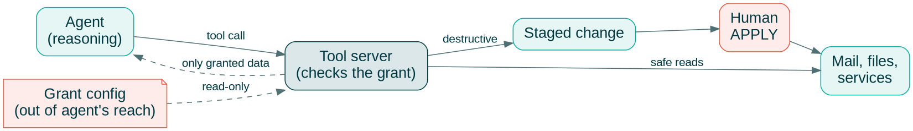

<!--
- Not about one agent framework: about the boundary around agents
- Running examples: notmutt (MCP server, deny by default) and HAMi (GPU slices per agent)
-->
@variant dark
@kicker Open Source Summit Europe 2026 - Open AI & Data

# Designing Permissioned AI Agents That Can Run Offline

@subtitle Enforce limits in the tool, not in the agent

@speaker name="Reza Jelveh" role="Solution Architect, Dynamia AI - Makers of HAMi" github=github.com/fishman linkedin=linkedin.com/in/rezajelveh

---

# Part 1: The Boundary Problem

@subtitle Agents now read files and call tools

---

<!--
- Chat was harmless: the human copied the answer
- Now the agent holds the keys: files, tools, state, other services
-->

## Agents Left the Chat Window

::: grid {cols=2}
::: card {tag=cyan}
### {icon:file-text cls=accent-primary} Read files

Mail, documents, code, config. Whatever the process can open.
:::
::: card {tag=green}
### {icon:wrench cls=accent-primary} Call tools

MCP servers, shell commands, REST APIs.
:::
::: card {tag=yellow}
### {icon:pencil cls=accent-contrast} Change state

Send, delete, tag, deploy. Some of it cannot be undone.
:::
::: card {tag=red}
### {icon:network cls=accent-secondary} Coordinate services

One agent drives several services, each with its own credentials.
:::
:::

---

<!--
- Cloud design: model, data and keys all meet at a third party
- Broad API keys: one token, every operation
- Offline is not an edge case: planes, factories, privacy rules
-->

## Where Cloud-Hosted Agents Break

::: grid {cols=2}
::: card {tag=red}
### {icon:cloud-upload cls=accent-secondary} Private data leaves the device

Every prompt carries context to someone else's server.
:::
::: card {tag=yellow}
### {icon:key cls=accent-contrast} Broad API keys

One token authorizes every operation the API has.
:::
::: card {tag=cyan}
### {icon:eye-off cls=accent-primary} Little visibility

The user cannot see what the agent is allowed to do.
:::
::: card {tag=green}
### {icon:wifi-off cls=accent-primary} No network, no agent

Nothing works when the connection drops or is cut on purpose.
:::
:::

---

<!--
OpenClaw deleted the Meta AI alignment director's entire mailbox: https://www.businessinsider.com/meta-ai-alignment-director-openclaw-email-deletion-2026-2. An MCP plugin hands an LLM full mail operations with no declared capabilities, so you hand-roll the harness: staging, sandboxing, review. The plugin itself has no boundary.
-->

## MCP Plugins: Do Not Trust the Tool

@subtitle You do not know if it wipes your mail

::: grid {cols=2}
::: card {tag=red}
### {icon:trash-2 cls=accent-secondary} Unknown destructive power

- OpenClaw wiped the Meta AI director's whole mailbox
- Your MCP tool can do the same: you do not know
:::
::: card {tag=yellow}
### {icon:shield-alert cls=accent-contrast} You build the harness

- LLM tries to break your system
- You hand-roll guards: staging, sandboxing, review
:::
:::

**You can audit a plugin, but a defensive security posture is better.**

---

<!--
- The core assumption of this talk
- An agent with write access to its own config will eventually widen its own grant
- Harnesses are useful: just do not bet on them
-->

## Assume Every Tool Is Hostile

@subtitle If it can reach the config, it will change it

- Every tool is risky by default, including the ones you wrote.
- An agent that can open its config file will find a way to rewrite its own limits.
- Build harnesses around agents, but assume they will break.
- So enforce the boundary **from the other side**: in the tool, not in the agent.

---

# Part 2: The Boundary Lives on the Other Side

@subtitle notmutt's MCP server as the example

---

<!--
- The model only proposes; the tool server decides
- The tool server holds the grant; the agent cannot see or edit it
- Destructive changes wait for a human
-->

## Separate Reasoning From Action

@subtitle The model proposes, the tool server decides



---

<!--
notmutt is an experimental mail client with an integrated MCP server. What the server may see is decided at config time, not at query time. Out-of-scope message ids are refused before any file is opened. The deleted folder is denied in code: no config can grant it.
-->

## notmutt: Deny by Default

@subtitle What the MCP server may see is a config-time decision

- An empty `[mcp]` section serves nothing.
- Accounts are granted by naming them; everything else is invisible.
- Capabilities are opt-in per account: attachments, bodies, tagging, archive.
- Out-of-scope messages are refused before any file is opened.
- The deleted folder is denied in code: no config can grant it.

::: notes
Source: github.com/fishman/notmutt, docs/man/notmutt.1.md (MCP)
:::

---

<!--
- Structural, not observational: do not filter what leaves, never load it
- A plugin with network access only ever sees metadata; mail bodies are never in its VM
- Network rules are one method plus one path, checked before dialing and on every redirect
- Unknown tool names are startup errors: a typo cannot silently widen the grant
-->

## A Tool Cannot Leak What It Never Receives

@subtitle What notmutt never loads into a plugin

- Network-enabled plugins only see metadata; mail bodies never enter their VM.
- Network rules are one method plus one path, checked again on every redirect.
- Unknown tool names in the allow list stop the server from starting.
- API keys are fetched per request and cleared after; never stored in config.

::: notes
Source: github.com/fishman/notmutt, docs/design-decisions.md (records 25, 26, 28)
:::

---

<!--
notmutt integrates an MCP server (go-mcp) with a defensive posture: tools whitelisted via [mcp] allow (unknown names are startup errors), plugin VMs with no os/io/debug (no filesystem), staged destructive commands (stage, then APPLY; the buffer is the undo). Sandbox is part of the design, not an agent guardrail the LLM can ignore.
-->

@layout image-right

## Integrated MCP: Boundaries in the Client

@subtitle Whitelist tools, no file writes, staged destruction

- **Whitelist tools:** `[mcp] allow` names each tool; unknown names are startup errors
- **No filesystem writes:** plugin VMs have no os/io/debug libraries
- **Staged destructive commands:** stage, then APPLY. The buffer is the undo
- **Sandbox in the design,** not an agent guardrail


---

<!--
- The same-disk caveat generalized: whatever defines the boundary must be physically out of reach
- Kubernetes gives you the primitives: separate service accounts, read-only mounts, no write RBAC on the ConfigMap
-->

## Keep the Grant Out of Reach

@subtitle The agent must not be able to edit its own limits

::: grid {cols=2}
::: card {tag=red}
### {icon:file-lock cls=accent-secondary} Config owned by someone else

Another user, a read-only mount, or a separate container. Never a file the agent can write.
:::
::: card {tag=yellow}
### {icon:hard-drive cls=accent-contrast} No shared disk

An agent that can read the maildir does not need the MCP server.
:::
::: card {tag=cyan}
### {icon:key-round cls=accent-primary} Secrets on demand

Fetched per request by a command, held for one call, never logged.
:::
::: card {tag=green}
### {icon:boxes cls=accent-primary} Separate identities

Model, tool server and destructive tools each run with their own account and permissions.
:::
:::

---

# Part 3: Least Privilege for Compute

@subtitle One device, several agents

---

<!--
Hermes and OpenClaw can reason and use tools. Running them at the edge is hard: not because of the models, but because of the compute underneath. Limited memory, tight power budgets, unattended operation, no elastic scaling. To run agents at the edge, fix the compute layer first.
-->

## Edge Agents, Starved Compute

@subtitle Offline means the model runs on hardware you own

::: grid {cols=2}
::: card {tag=red}
### {icon:memory-stick cls=accent-secondary} Limited memory

A Jetson-class device has 8-64 GB of unified memory, shared with the OS. One agent stack can eat it all.
:::
::: card {tag=yellow}
### {icon:zap cls=accent-contrast} Tight power budgets

No 300 W data-center GPU at the edge. You get 5-40 W, often battery or solar.
:::
::: card {tag=cyan}
### {icon:user-x cls=accent-primary} Unattended

No cluster admin on call. It has to work after setup.
:::
::: card {tag=green}
### {icon:scale cls=accent-primary} No elastic scaling

Cloud load grows: add GPUs. Edge load grows: nothing to add. The deployed box is all you get.
:::
:::

---

<!--
GPUs are expensive and often underutilized. HAMi is a heterogeneous GPU sharing framework for Kubernetes, a CNCF Incubating project. It slices GPUs and shares them across workloads, without rewriting your stack.
-->

## What is HAMi

@subtitle Before: one device, one task


---

## What is HAMi
@transition none

@subtitle After: one device, many agents


---

<!--
Without isolation, one workload can grab all memory and OOM-kill the other tasks on the same device. HAMi enforces memory when it hijacks the runtime calls: every task sees only its own slice. Footnote: the limit is enforced inside the container, so it stops accidents and greedy agents, not a determined attacker. Destructive tools belong in a VM; GPU slicing for VMs is harder (passthrough, vendor vGPU or MIG), so keep the GPU on the model side.
-->

## Least Privilege for the GPU

@subtitle One greedy agent must not starve its neighbors

::: grid {cols=3}
::: card {tag=red}
### {icon:triangle-alert cls=accent-secondary} Without HAMi

Agents share a device with no borders. One greedy agent eats all memory and kills the neighbors. On an 8 GB Jetson, that is the whole device.
:::
::: card {tag=green}
### {icon:shield-check cls=accent-primary} With HAMi

Each agent sees only its slice. Every allocation is checked against it.
:::
::: card {tag=cyan}
### {icon:gauge cls=accent-contrast} Per-agent limits

```yaml
resources:
  limits:
    nvidia.com/gpu: 1
    nvidia.com/gpumem: 3000
```
:::
:::

@tiny Footnote: destructive tools are safer in a VM, since escaping a container is easier. GPU slicing for VMs is harder: passthrough, vendor vGPU or MIG.

---

# Part 4: Local and Offline

@subtitle Run it on your hardware, then cut the network

---

<!--
The path is short. Pick a device: Jetson-class for CUDA compatibility (the HAMi slicing path exists for CUDA). Slice it: memory in MiB, compute in percent, hard limits per agent. Schedule agents: binpack to pack them tight, spread for SLOs. Everything runs on k3s or k0s. Olares is the turnkey path: an open-source, k3s-based personal cloud OS that ships this stack pre-installed, with MCP and GPU scheduling built in.
-->

## Keep Sensitive Context Local

@subtitle Three steps to a multi-agent edge device

::: grid {cols=3}
::: card {tag=green}
### {icon:cpu cls=accent-primary} 1. Pick a device

Jetson-class GPU: CUDA compatible, so HAMi can slice it.
:::
::: card {tag=cyan}
### {icon:gauge cls=accent-primary} 2. Slice it

Memory and compute per agent, with hard limits.
:::
::: card {tag=yellow}
### {icon:git-branch cls=accent-contrast} 3. Schedule agents

Binpack many agents onto one device; spread when latency matters.
:::
:::

- Prompts, documents and mail never leave the device.
- **Olares** ([github.com/beclab/olares](https://github.com/beclab/olares)): k3s-based personal cloud OS with HAMi and MCP built in.
- Or run on k3s or k0s directly: Kubernetes APIs without an ops team.

---

<!--
- Deny all egress (NetworkPolicy or firewall) and run the real workflow
- Refused calls are good news: they show the boundary held
- Per-agent GPU numbers come from HAMi's runtime monitor on CUDA devices (NVIDIA, Jetson); NPUs differ
-->

## Evaluate With the Network Cut

@subtitle Block egress and run the real workflow

- Block all outbound traffic on purpose, then run the real workflow.
- Does it finish, or fail safely without half-applied changes?
- Check what was refused: tool calls, hosts, out-of-scope data.
- Check each agent's GPU memory against its slice (CUDA devices via HAMi).
- A missing metric is missing, not zero.

---

<!--
- The boundary is enforced by the tool, the config and the scheduler, never by the agent's good behavior
-->

## Takeaways

- Assume every tool is hostile; enforce limits on the other side.
- Separate reasoning from action: the model proposes, the tool server decides.
- Grant nothing by default; keep the grant out of the agent's reach.
- Give each agent its own compute slice, on hardware you own.
- Test offline on purpose.

---

@layout ecosystem
## Community & Adopters

@subtitle Devices, integrations, and who uses HAMi

<!--
5.2k stars, 325k pulls, 500+ contributors, 27 countries. 11 device types, 20+ adopters.
-->

#### Open Source, CNCF Backed, Production Ready
::: grid {cols=5}
::: card {metric}
5.2k
Github Stars
:::
::: card {metric}
325k
Docker Pulls
:::
::: card {metric}
500+
Contributors
:::
::: card {metric}
27
Contributor Countries
:::
::: card

     
:::
:::

#### Ecosystem & Device Support
::: grid {cols=2}
::: card
    
   
 
:::
:::

#### Adopters
::: grid {cols=2}
::: card
    
    
    
    
:::
:::

---

@kicker Thank You
@side-image assets/qr-notmutt.png
# Questions?

@subtitle github.com/Project-HAMi/HAMi - github.com/fishman/notmutt

@speaker name="Reza Jelveh" role="Solution Architect, Dynamia AI - Makers of HAMi" github=github.com/fishman linkedin=linkedin.com/in/rezajelveh
